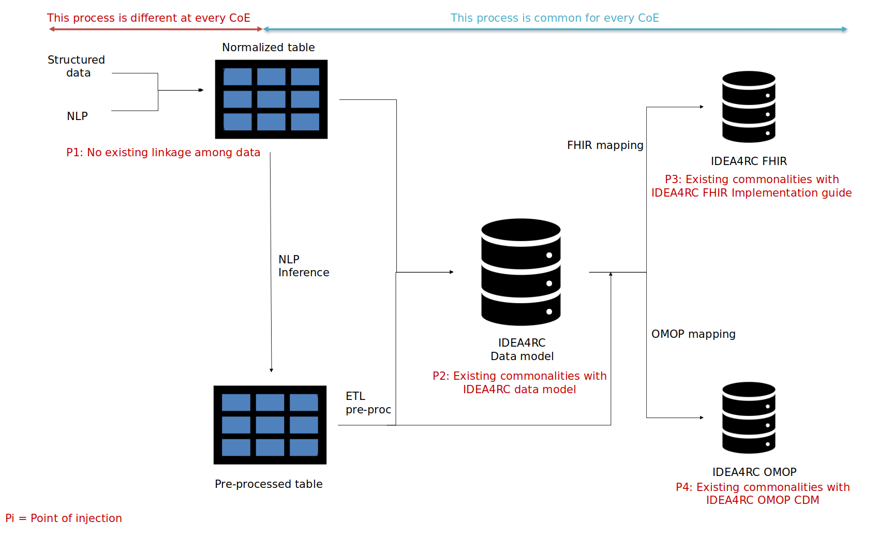

# Table of contents

- [DATA MESH](#focusing-manager)
  - [Table of contents](#table-of-contents)
  - [Requirements](#requirements)
  - [Deployment](#deployment)
  - [Development](#development)
  - [Getting help](#getting-help)
  - [License](#license)
  - [Authors and history](#authors-and-history) 
  
# DATA MESH

This mesh will be defined to be the infrastructure to hold the data, giving it an extra layer of security by creating a zero trust network to hold the databases and creating spefic role based authentication to the ETL to populate the databases.

The followuing figure explains the database architecture contained in this mesh.




## Requirements

## Deployment

For testing purposes kind will be used during the development stage.

Instaling kind with the [quick start guide](https://kind.sigs.k8s.io/docs/user/quick-start/) and the then set up the local registry for the k8s using the following script by kind community

```bash
#!/bin/sh
set -o errexit

# 1. Create registry container unless it already exists
reg_name='kind-registry'
reg_port='5001'
if [ "$(docker inspect -f '{{.State.Running}}' "${reg_name}" 2>/dev/null || true)" != 'true' ]; then
  docker run \
    -d --restart=always -p "127.0.0.1:${reg_port}:5000" --name "${reg_name}" \
    registry:2
fi

# 2. Create kind cluster with containerd registry config dir enabled
# TODO: kind will eventually enable this by default and this patch will
# be unnecessary.
#
# See:
# https://github.com/kubernetes-sigs/kind/issues/2875
# https://github.com/containerd/containerd/blob/main/docs/cri/config.md#registry-configuration
# See: https://github.com/containerd/containerd/blob/main/docs/hosts.md
cat <<EOF | kind create cluster --config=-
kind: Cluster
apiVersion: kind.x-k8s.io/v1alpha4
containerdConfigPatches:
- |-
  [plugins."io.containerd.grpc.v1.cri".registry]
    config_path = "/etc/containerd/certs.d"
EOF

# 3. Add the registry config to the nodes
#
# This is necessary because localhost resolves to loopback addresses that are
# network-namespace local.
# In other words: localhost in the container is not localhost on the host.
#
# We want a consistent name that works from both ends, so we tell containerd to
# alias localhost:${reg_port} to the registry container when pulling images
REGISTRY_DIR="/etc/containerd/certs.d/localhost:${reg_port}"
for node in $(kind get nodes); do
  docker exec "${node}" mkdir -p "${REGISTRY_DIR}"
  cat <<EOF | docker exec -i "${node}" cp /dev/stdin "${REGISTRY_DIR}/hosts.toml"
[host."http://${reg_name}:5000"]
EOF
done

# 4. Connect the registry to the cluster network if not already connected
# This allows kind to bootstrap the network but ensures they're on the same network
if [ "$(docker inspect -f='{{json .NetworkSettings.Networks.kind}}' "${reg_name}")" = 'null' ]; then
  docker network connect "kind" "${reg_name}"
fi

# 5. Document the local registry
# https://github.com/kubernetes/enhancements/tree/master/keps/sig-cluster-lifecycle/generic/1755-communicating-a-local-registry
cat <<EOF | kubectl apply -f -
apiVersion: v1
kind: ConfigMap
metadata:
  name: local-registry-hosting
  namespace: kube-public
data:
  localRegistryHosting.v1: |
    host: "localhost:${reg_port}"
    help: "https://kind.sigs.k8s.io/docs/user/local-registry/"
EOF

```

Next step is to set up istio

```shell
curl -L https://istio.io/downloadIstio | sh -

# or for a specific version (this README was written using 1.18.0)
curl -L https://istio.io/downloadIstio | ISTIO_VERSION=1.18.0 TARGET_ARCH=x86_64 sh -


# Add Istio to your path so it will be easier to use.
cd istio-1.18.0/
export PATH=$PWD/bin:$PATH
```
Install Istio operator. (https://istio.io/latest/docs/setup/platform-setup/). It is installed with [001_istio-operator.yaml](./kubernetes/001_operator.yaml).

Next step is to set up the istio injection in the default namespace 

```shell
kubectl label namespace default istio-injection=enabled
```

The gateway is needed to expose the control planes for the OMOP and FHIR interfaces, while using kind on a linux machine its neccesary to set up the MetalLB for load balancing the ingress gateway.

First install the k8s component:

```shell
kubectl apply -f https://raw.githubusercontent.com/metallb/metallb/v0.13.7/config/manifests/metallb-native.yaml
```
Then


## Development

## Getting help

License
------

```
Copyright 2022 Universidad Politécnica de Madrid

Licensed under the Apache License, Version 2.0 (the "License");
you may not use this file except in compliance with the License.
You may obtain a copy of the License at

    http://www.apache.org/licenses/LICENSE-2.0

Unless required by applicable law or agreed to in writing, software
distributed under the License is distributed on an "AS IS" BASIS,
WITHOUT WARRANTIES OR CONDITIONS OF ANY KIND, either express or implied.
See the License for the specific language governing permissions and
limitations under the License.
```

Authors and history
---------------------------
- Alejo Esteban ([@aeolmo]())
- Alejandro Alonso ([@aalonso]())
